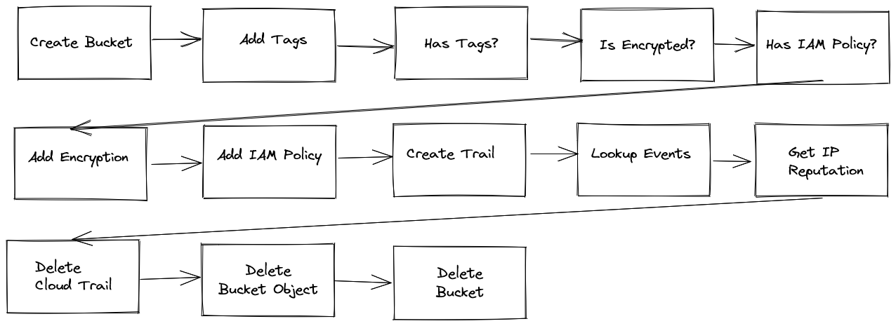
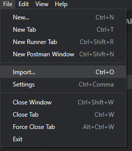
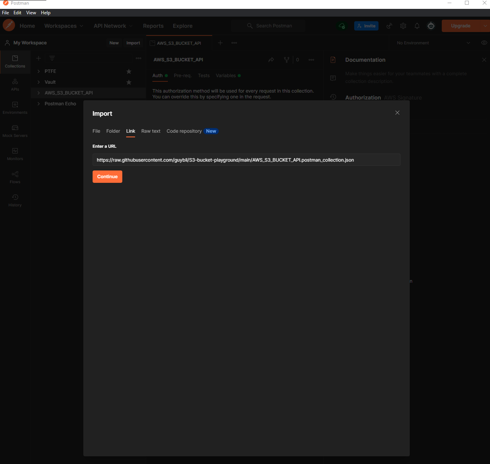
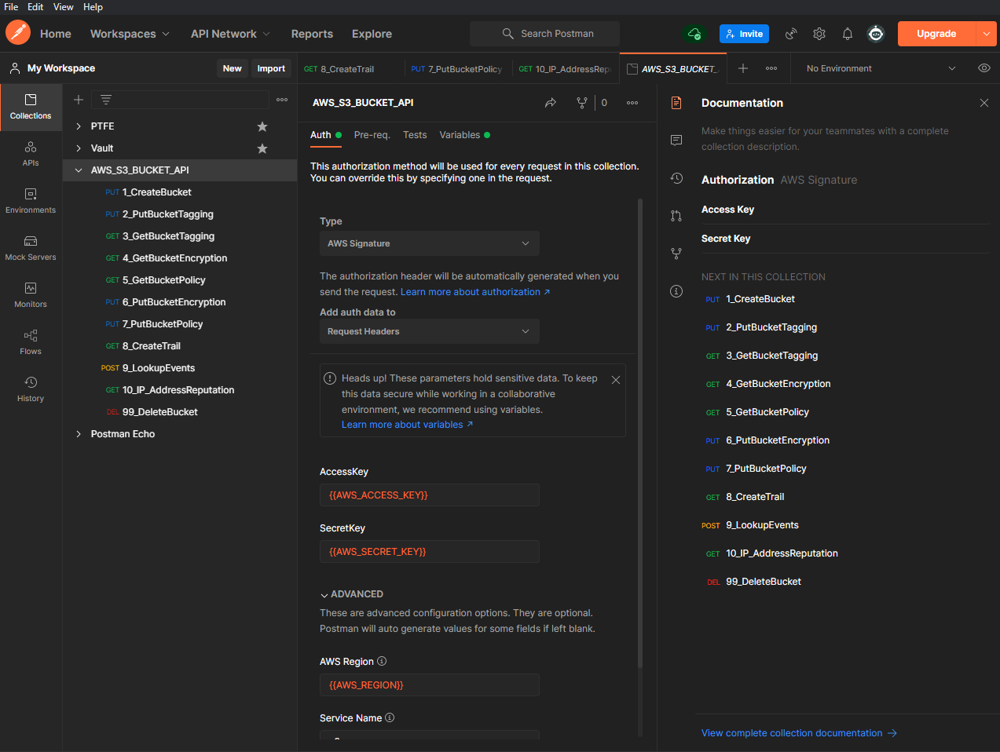
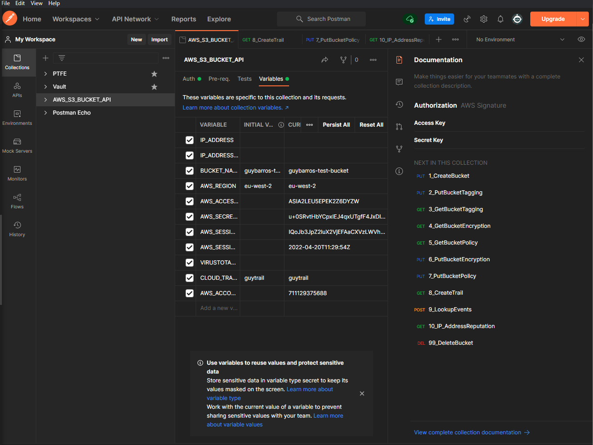
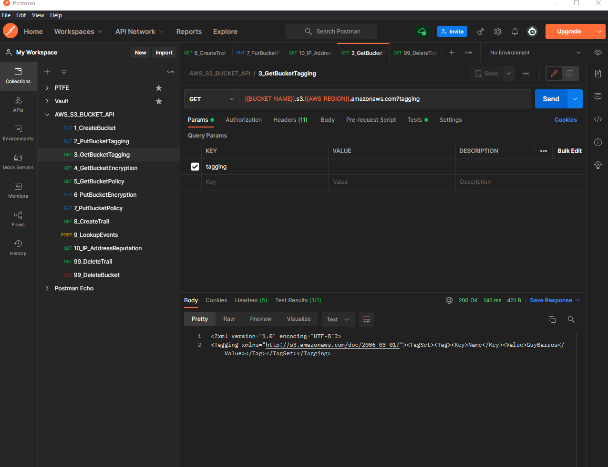
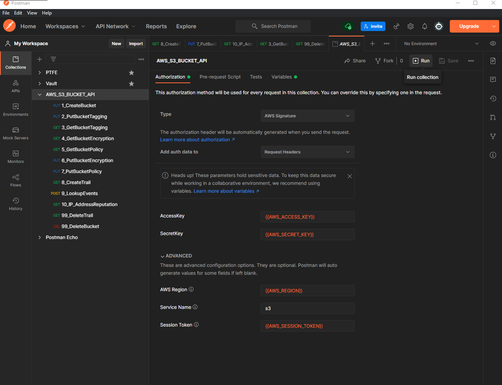
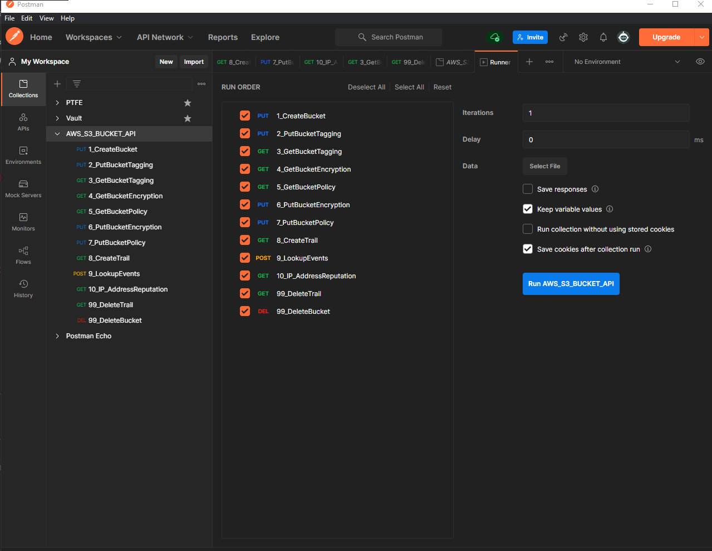
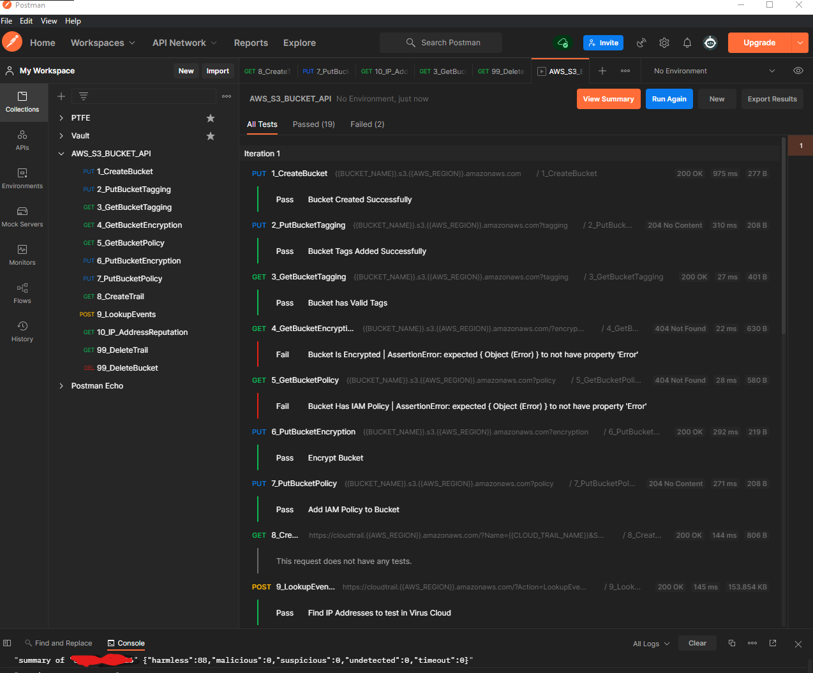

# AWS-S3-API-bucket-playground

This repo holds a Postman collection to:

* Create a bucket
* Add tags to a Bucket
* Check if a bucket has tags
* Check if a bucket is encrypted
* Check if a bucket has a IAM policy
* Add Encryption a bucket
* Add IAM Policy to a bucket
* Create a Cloud trail
* Check Cloud trail for ConsoleLogin events and create an array of source IPs
* Check IP Addresses' reputation against Virustotal api
* delete cloud trail
* delete bucket

## Pre requisites

[AWS access key](https://aws.amazon.com/premiumsupport/knowledge-center/create-access-key/) and [Virustotal API key](https://developers.virustotal.com/reference/getting-started) will be needed.

### Add Collection to Postman

 To import this colletion to your postman, go to File -> Import (Ctrl - O)

 Then choose link , and add the raw link to the Collection in this repo:

  https://raw.githubusercontent.com/guybli/S3-bucket-playground/main/AWS_S3_BUCKET_API.postman_collection.json

 Then you should be able to see the Collection in Postman

### Add Variables

This collection requires certain variables to work:

* IP_ADDRESS (Auto Populated)
* IP_ADDRESSES (Auto Populated)
* BUCKET_NAME
* AWS_REGION
* AWS_ACCESS_KEY
* AWS_SECRET_KEY
* AWS_SESSION_TOKEN
* AWS_SESSION_EXPIRATION
* VIRUSTOTAL_API_KEY
* CLOUD_TRAIL_NAME
* AWS_ACCOUNT_ID
* BUCKET_OBJECT_KEY (Auto Populated)

These can be added from the *Variables* Tab of the Collection:

## Running

There are two options to run these requests, either individually or as a collection

### Individual Requests Run

to run an individual request, choose the request from the left hand menu , then press Send to run request.

### Collection Run

it is possible to run all requests in order, double click on the collection name and choose run:

a new *Runner* tab will appear:

this will show all the test results in Postman and will show in the console the summary of information from VirusTotal

## Closing

this is a quick demo  to highlight how we can use the power of APIs to automate security processes.

as always, PR welcomed.